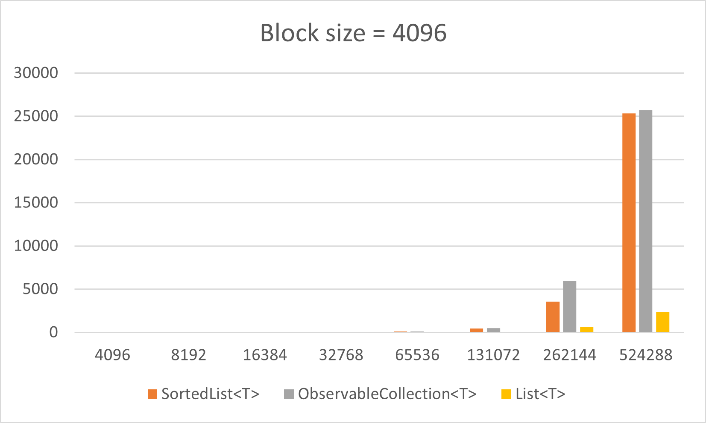
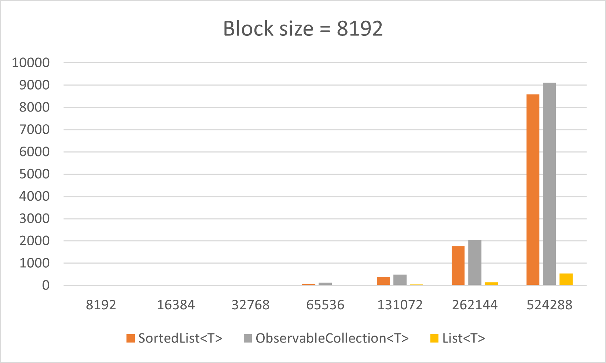
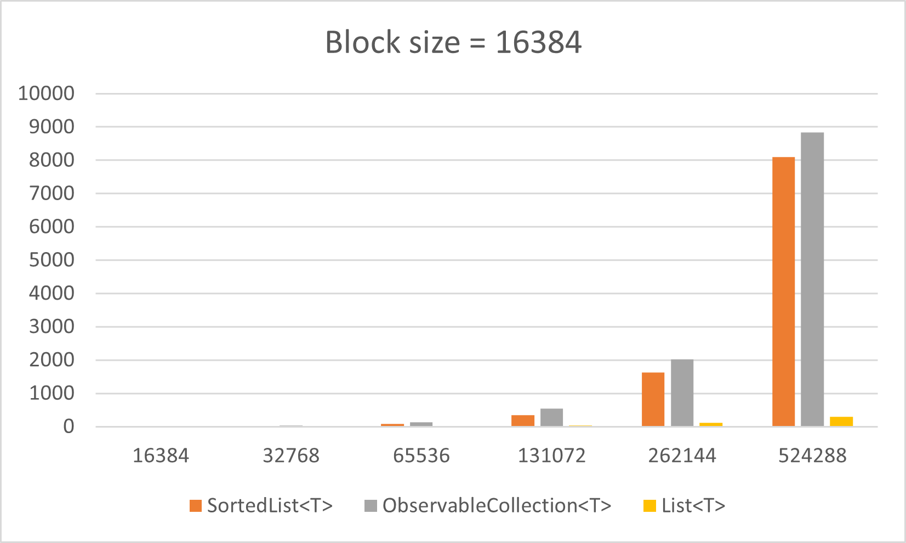
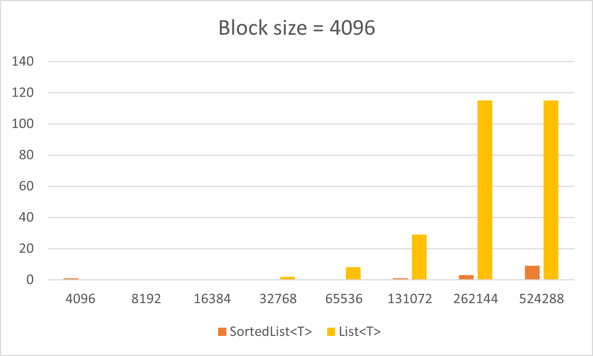
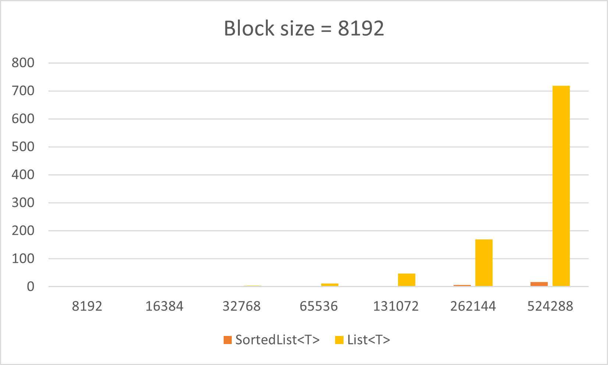
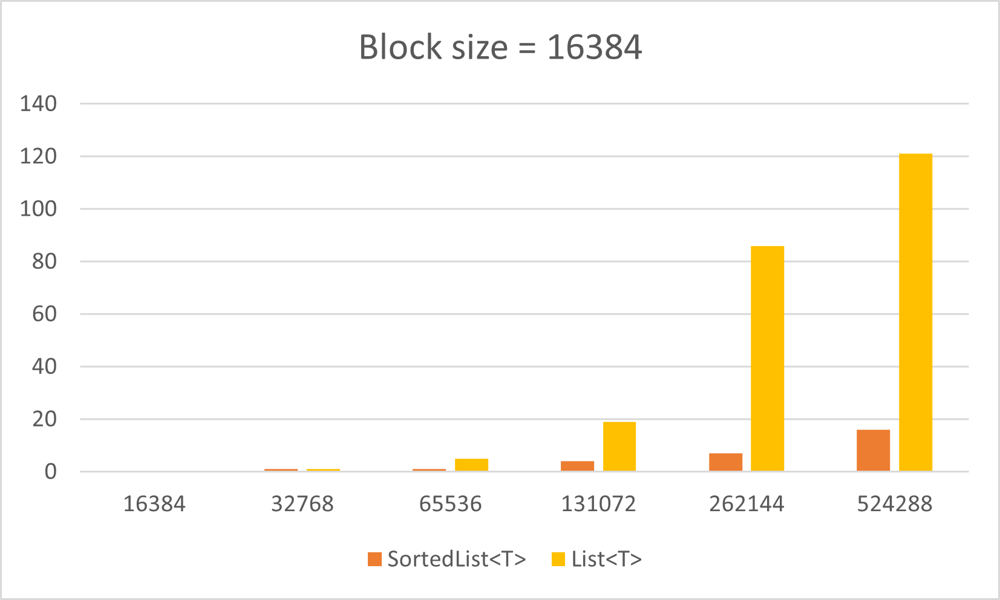

# SortedList&lt;T&gt;
An implementation of ```IList<T>``` and ```INotifyCollectionChanged``` designed for the following cases: 
* To make sure the items in list are always be placed in specific order.
* To display the list on UI.
* You will modifying the list incrementally.

## Comparing to List&lt;T&gt;
It is the best for you to use ```List<T>``` if you just need to build a sorted list. It provides good performance for adding, sorting and removing items. But you cannot monitor its change because it doesn't implement ```INotifyCollectionChanged``` interface. It may not suitable for you to use it for UI directly if you will modify the list at anytime.

## Comparing to System.Collections.Generic.SortedList&lt;K, V&gt;
There is already a class called ```SortedList<K, V>``` provided by .NET class library. It is actually an ```IDictionary<K, V>``` but not ```IList<T>```, so it is not easy for you to display as a list on UI. Also, it doesn't implement ```INotifyCollectionChanged``` interface so you cannot monitor its change.

## Comparing to ObservableCollection&lt;T&gt;
```ObservableCollection<T>``` is good for you to use it to display on UI, but it doesn't provide a way to add more than one items at same time. Further more, you need to keep items sorted by finding proper insertion position by yourself everytime when you want to add an item.

## Add item(s)
* Call ```Add(T)``` to add an item.
* Call ```AddAll(IEnumerable<T>, bool)``` to add zero or more items. The adding action will be split into one or more ```CollectionChanged``` events according to there insertion positions. Further more, you can indicate whether the insertion items are already sorted or not to prevent unnecessary internal sorting.

## Removing item(s)
* Call ```Remove(T)``` to remove one item.
* Call ```RemoveAll(IEnumerable<T>)``` to remove zero or more items from list. The removing action will be split into one or more ```CollectionChanged``` events according to there removing positions.
* Call ```RemoveRange(int, int)``` to remove a range of items directly.

## Performance
### Adding random items block-by-block
In this case, all adding items are unpredicted and each block of adding items may overlap with other blocks.

#### How to add items
* SortedList&lt;T&gt;
```
foreach block B to be added
    sortedList.AddAll(B)
```
* ObservableCollection&lt;T&gt;
```
foreach block B to be added
    foreach item T in B
        I = observableCollection.BinarySearch(T)
        observableCollection.Insert(I, T)
```
* List&lt;T&gt;
```
foreach block B to be added
    list.AddRange(B)
    list.Sort()
```

#### Conclusion
In most cases, performance of ```SortedList<T>``` is slightly better than ```ObservableCollection<T>``` but much worse than ```List<T>```. It should be expected result because the insertion items are totally randomized, each block insertion will be splitted into lots of small parts which makes lots of data moving inside the list.

#### Test result
* Block size = 4096

  List size=>|4096|8192|16384|32768|65536|131072|262144|524288
---|---|---|---|---|---|---|---|---
```SortedList<T>```|4ms|3ms|8ms|26ms|106ms|443ms|3537ms|25349ms
```ObservableCollection<T>```|4ms|7ms|21ms|33ms|123ms|478ms|5964ms|25739ms
```List<T>```|0ms|1ms|3ms|6ms|20ms|65ms|655ms|2361ms

* Block size = 8192

  List size=>|8192|16384|32768|65536|131072|262144|524288
---|---|---|---|---|---|---|---
```SortedList<T>```ms|2ms|3ms|21ms|84ms|388ms|1776ms|8591ms
```ObservableCollection<T>```ms|5ms|11ms|5ms|123ms|491ms|2051ms|9113ms
```List<T>```ms|0ms|1ms|4ms|14ms|42ms|139ms|539ms

* Block size = 16384

  List size=>|16384|32768|65536|131072|262144|524288
---|---|---|---|---|---|---
```SortedList<T>```|1ms|17ms|80ms|351ms|1631ms|8096ms
```ObservableCollection<T>```|10ms|36ms|135ms|533ms|2012ms|8830ms
```List<T>```|1ms|3ms|9ms|30ms|113ms|296ms

* Charts

  <a href="../images/sorted_list_pref_random_adding_4096.png"></a>
<a href="../images/sorted_list_pref_random_adding_8192.png"></a>
<a href="../images/sorted_list_pref_random_adding_16384.png"></a>

### Adding random items block-by-block non-overlapped
Like previous test, we add random items block-by-block but items in each block doesn't overlap with any other blocks.

#### Conclusion
In this case, performance of ```SortedList<T>``` is much better then ```List<T>``` because ```SortedList<T>``` is optimized for this case. Therefore, it is good choice to use ```SortedList<T>``` if your known that the item blocks you add are almost not overlapped.

#### Test result
* Block size = 4096

  List size=>|4096|8192|16384|32768|65536|131072|262144|524288
---|---|---|---|---|---|---|---|---
```SortedList<T>```|1ms|0ms|0ms|0ms|0ms|1ms|3ms|9ms
```ObservableCollection<T>```|1ms|2ms|6ms|34ms|78ms|500ms|1440ms|20298ms
```List<T>```|0ms|0ms|0ms|2ms|8ms|29ms|115ms|115ms

* Block size = 8192

  List size=>|8192|16384|32768|65536|131072|262144|524288
---|---|---|---|---|---|---|---
```SortedList<T>```|0ms|0ms|0ms|2ms|3ms|7ms|17ms
```ObservableCollection<T>```|3ms|7ms|45ms|253ms|1303ms|5095ms|21509ms
```List<T>```|0ms|0ms|4ms|12ms|47ms|169ms|719ms

* Block size = 16384

  List size=>|16384|32768|65536|131072|262144|524288
---|---|---|---|---|---|---
```SortedList<T>```|0ms|1ms|1ms|4ms|7ms|16ms
```ObservableCollection<T>```|7ms|14ms|187ms|853ms|3964ms|19292ms
```List<T>```|0ms|1ms|5ms|19ms|86ms|121ms

* Charts

  <a href="../images/sorted_list_pref_random_adding_non_overlapped_4096.png"></a>
<a href="../images/sorted_list_pref_random_adding_non_overlapped_8192.png"></a>
<a href="../images/sorted_list_pref_random_adding_non_overlapped_16384.png"></a>